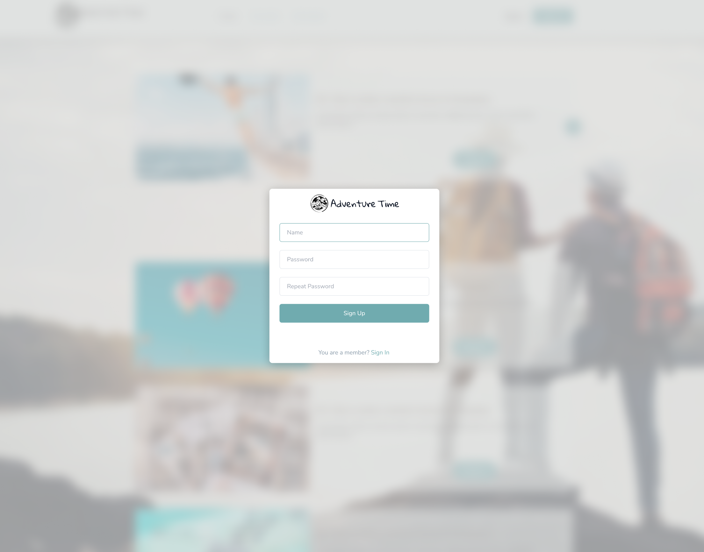
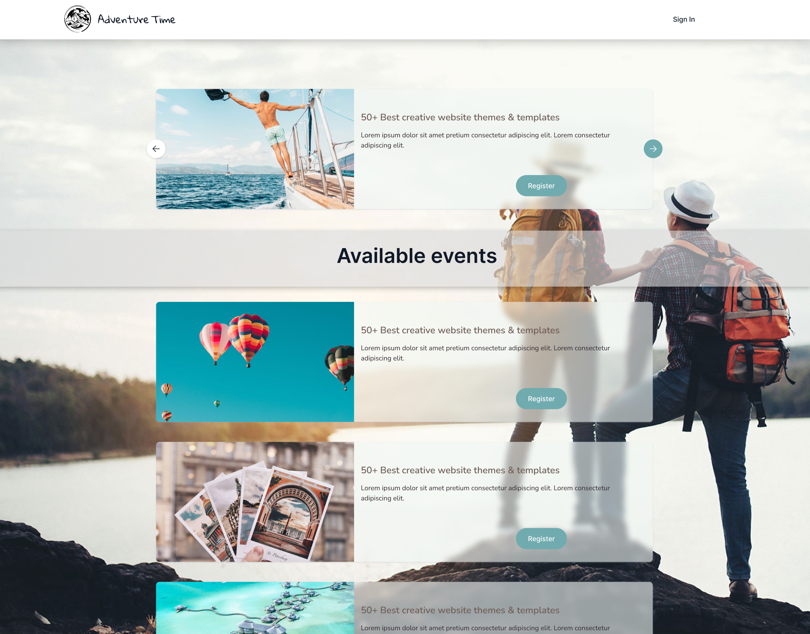
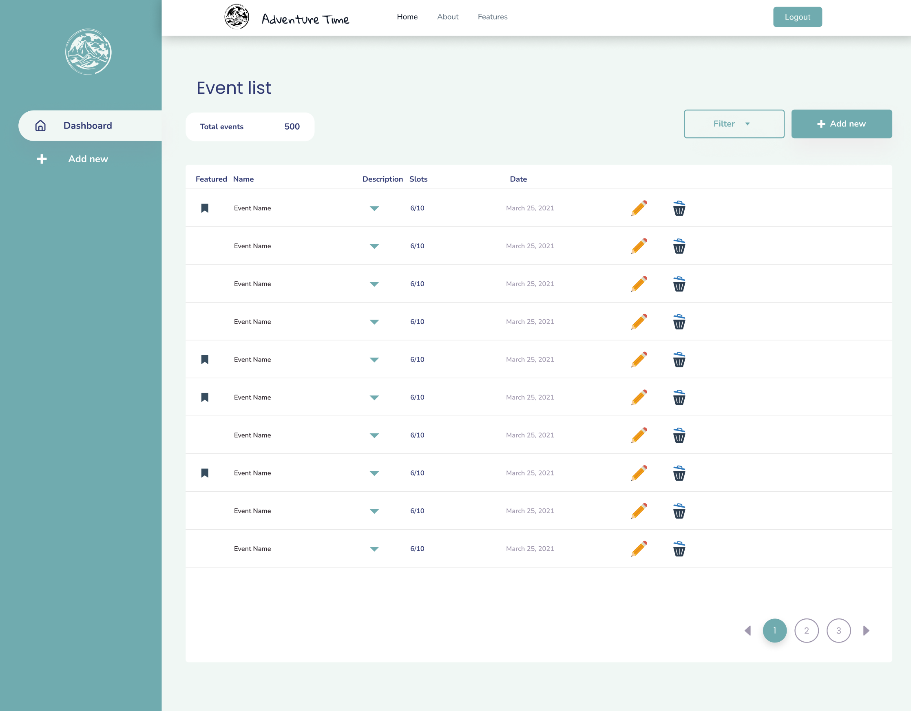
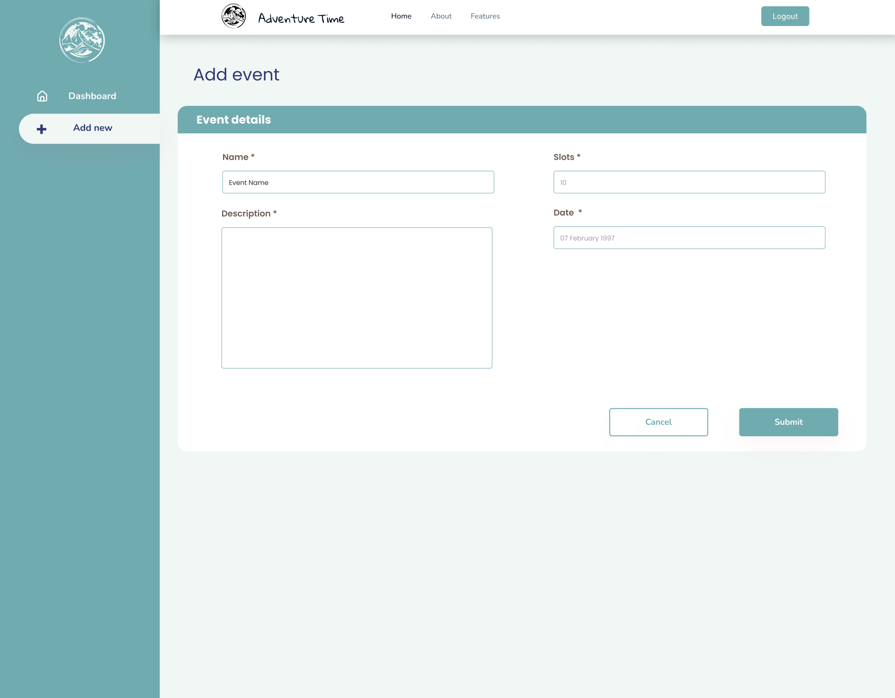

# Adventure Time - Gestión de Eventos Online 🎯

## Descripción
Adventure Time es una aplicación web desarrollada con Spring Boot que permite gestionar eventos online como talleres, masterclass y webinars. La plataforma ofrece funcionalidades tanto para usuarios regulares como para administradores.







## Características principales 🚀

### Usuarios
- Visualización de eventos disponibles
- Registro y cancelación en eventos
- Consulta de eventos inscritos
- Gestión de perfil personal

### Administradores
- Gestión completa de eventos (CRUD)
- Administración de usuarios
- Visualización de estadísticas
- Control de participantes

## Tecnologías utilizadas 💻

### Backend:
- Java 17
- Spring Boot 3.3.2
- Spring Security
- JPA/Hibernate
- Firebase Storage

### Base de datos:
- MySQL
- H2 (desarrollo)

### Herramientas:
- Maven
- Docker
- Postman
- MySQL Workbench

## Requisitos previos 📋

- Java 17 o superior
- Maven 3.6+
- Docker
- MySQL

## Instalación y configuración 🔧

1. Clonar el repositorio:

```sh
git clone https://github.com/PabloA1A/ProjectF5-AdventureTime-Back
`````

2. Configurar variables de entorno:

```sh
SPRING_APPLICATION_NAME=adventure-time
SPRING_PROFILES_ACTIVE=dev
DATABASE_USERNAME=your_username
DATABASE_PASSWORD=your_password
`````

3. Ejecutar la aplicación:

```sh
mvn spring-boot:run
`````

## API Endpoints 🛣️

### Eventos

```sh
GET    /api/v1/event/all          # Listar todos los eventos
GET    /api/v1/event/{id}         # Obtener evento específico
POST   /api/v1/event              # Crear nuevo evento
PUT    /api/v1/event              # Actualizar evento
DELETE /api/v1/event              # Eliminar evento
`````

### Participantes

```sh
POST   /api/v1/participant        # Registrar participante
DELETE /api/v1/participant        # Eliminar participante
`````

### Autenticación

```sh
POST   /api/v1/register           # Registro de usuario
GET    /api/v1/login              # Inicio de sesión
`````

## Seguridad 🔐

La aplicación implementa:

- Autenticación básica
- Roles de usuario (ADMIN, USER)
- CORS configurado
- Encriptación de contraseñas con BCrypt

## Arquitectura 🏗️

```sh
src/
├── main/
│   ├── java/
│   │   └── org/forkingaround/adventuretime/
│   │       ├── config/
│   │       ├── controllers/
│   │       ├── models/
│   │       ├── repositories/
│   │       └── services/
│   └── resources/
└── test/
`````

## Contribución 🤝

1. Fork del repositorio
2. Crear rama para feature (git checkout -b feature/AmazingFeature)
3. Commit cambios (git commit -m 'Add: nueva característica')
4. Push a la rama (git push origin feature/AmazingFeature)
5. Abrir Pull Request

¡Gracias por usar Adventure Time!